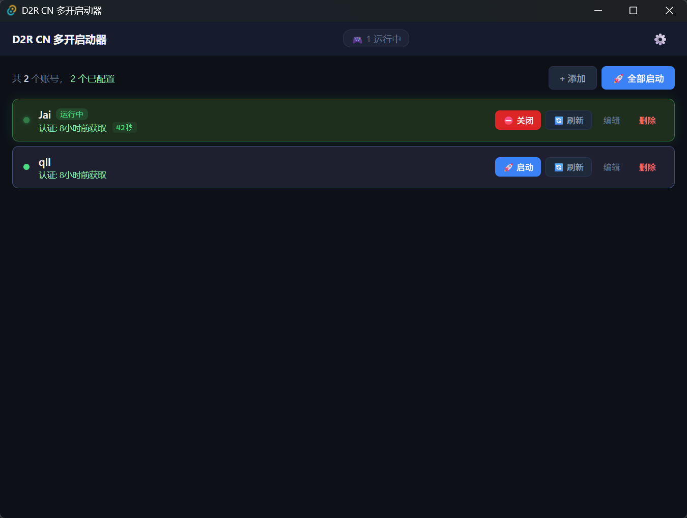

# D2R CN 多开启动器

暗黑破坏神II：重制版（国服）多开启动器 — 一个程序搞定多开、登录、Token、排队启动。

[功能特性](#功能特性) • [快速开始](#快速开始) • [常见问题](#常见问题)

---

## ️ 界面预览

---

##  功能特性

### 多开管理
- **一个窗口管理所有账号** — 添加、启动、关闭、删除，一目了然
- **批量一键启动** — 点击"全部启动"，所有已配置账号自动排队依次启动
- **实时状态监控** — 每个账号的运行状态、游戏时长、进程 PID 实时显示
- **智能排队** — 前一个账号登录完成后再启动下一个，避免 Token 冲突

### Token 自动化
- **内置浏览器自动登录** — 点击"获取认证"，自动弹出战网登录窗口
- **Token 自动提取** — 登录成功后自动捕获 Token 并保存，无需手动操作
- **一键刷新** — Token 过期后点击"刷新"即可重新获取

### 多开支持
- **自动解除互斥锁** — 内置 Handle 工具，自动关闭游戏互斥锁，支持同时运行多个客户端
- **窗口自动命名** — 游戏窗口标题显示账号名称，方便快速识别
- **批量窗口布局** — 一键排列游戏窗口位置（横排、竖排、网格），整齐不重叠

### 安全便捷
- **本地加密存储** — Token 使用 Windows DPAPI 加密，仅当前用户可解密
- **自动更新** — 启动时自动检测新版本，一键下载安装
- **进程级关闭** — 精准关闭指定游戏进程，不影响其他窗口

---

## 🚀 快速开始

### 下载安装
1. 前往 [Releases](https://github.com/dulingzhi/D2RLauncher/releases) 下载最新版 `.exe`
2. 运行安装程序，完成安装
3. 首次打开需要设置游戏路径

### 首次使用（3 步）

**1️⃣ 设置游戏路径**
- 点击顶栏右侧 ⚙️ 设置图标
- 点击"浏览"选择 `D2R.exe` 所在目录
- 点击"保存设置"

**2️ 添加账号**
- 点击"＋ 添加"按钮
- 输入账号名称（如：小号1），点击保存

**3️ 获取认证**
- 在账号卡片上点击"🔑 获取"
- 在弹出的窗口中登录战网
- 登录成功后 Token 自动保存

### 启动游戏

| 方式 | 操作 |
|---|---|
| 单个启动 | 点击账号卡片上的"🚀 启动" |
| 批量启动 | 点击顶栏的"🚀 全部启动"，所有账号依次启动 |
| 关闭游戏 | 运行中时点击" 关闭"，精准关闭对应进程 |

---

## ❓ 常见问题

**Q: 程序无法启动游戏？**
> 检查设置中的游戏路径是否正确，确保指向 `D2R.exe` 所在目录。

**Q: Token 获取失败？**
> 确保网络连接正常，能访问战网登录页面。可尝试重新获取。

**Q: 批量启动时卡住不动？**
> 启用"等待登录完成"选项后，系统会等待前一个账号到达角色选择界面。如果等待超时，会自动继续下一个。

**Q: 第二个游戏窗口打不开？**
> 程序已内置 Handle 工具自动处理互斥锁，如仍有问题，请尝试以管理员身份运行。

---

## 🔐 安全说明

- **Token 加密存储** — 使用 Windows DPAPI，仅当前用户可解密
- **数据完全本地化** — 所有信息保存在本地，不上传任何服务器
- **开源透明** — 源代码完全开放，可自行审查和编译

---

## 🤝 贡献

欢迎提交 Issue 和 Pull Request！

1. Fork 本仓库
2. 创建特性分支 (`git checkout -b feature/AmazingFeature`)
3. 提交更改 (`git commit -m 'Add some AmazingFeature'`)
4. 推送到分支 (`git push origin feature/AmazingFeature`)
5. 提交 Pull Request

---

## 📄 开源协议

MIT 协议 — 详见 [LICENSE](LICENSE) 文件

---

## 🙏 致谢

- [Tauri](https://tauri.app/) — 跨平台桌面应用框架
- [Vue.js](https://vuejs.org/) — 前端框架
- [Rust](https://www.rust-lang.org/) — 系统编程语言
- [Handle (Sysinternals)](https://docs.microsoft.com/en-us/sysinternals/downloads/handle) — 进程句柄管理工具

---

**⭐ 如果这个项目对你有帮助，请给个 Star！⭐**

Made with ❤️ by D2R Players

